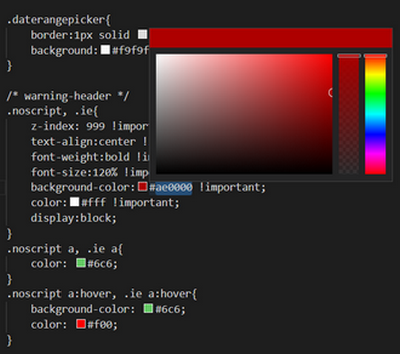
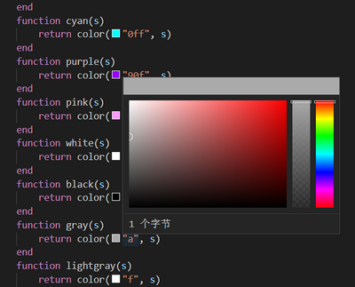

# Color Picker

This color picker is an extension of vscode.

If you encounter any problem, please [let us know](https://github.com/zengfanfan/ColorPicker/issues).

## Features

1. Custom color format easily
2. File filter, by language or by path pattern
3. Support gray scale

## Settings

This extension contributes the following settings:

* `zeng-color-picker.Filter.ApplyForTheseLanguages`: filter files by language
* `zeng-color-picker.Filter.ApplyForTheseFiles`: filter files by [glob pattern](https://code.visualstudio.com/api/references/vscode-api#GlobPattern)
* `zeng-color-picker.Preview.MatchPatterns`: specify what color strings looks like
* `zeng-color-picker.Picker.InsertAfterPick`: specify how to insert a color string after pick

## Release Notes

See [ChangeLog](CHANGELOG.md).
